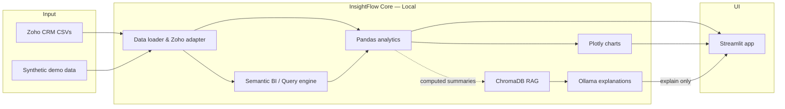

# InsightFlow AI

### Private Revenue Operations Agent — Local, Secure, Deterministic

<div align="center">

**Explore Zoho CRM pipeline data. Ask business questions. Get grounded answers — without sending a single row to the cloud.**

[](https://www.python.org/)
[](https://streamlit.io/)
[](https://pandas.pydata.org/)
[](https://ollama.com/)
[](https://www.trychroma.com/)
[](#architecture)

<br />

[Features](#features) · [Architecture](#architecture) · [Quick Start](#quick-start) · [Ask Engine](#ask-insightflow-ai) · [Zoho Compatibility](#zoho-crm-compatibility)

</div>

---

## Overview

**InsightFlow AI** is a local-first revenue operations dashboard for teams that need fast, private pipeline analysis. Load synthetic demo data or upload Zoho CRM CSV exports, explore leads and deals, surface Auto Insights, and ask metric, chart, and management questions — all on your machine.

Calculations are **deterministic Pandas**. Charts are **Plotly**. In the default local mode, optional **Ollama** explanations never compute totals and company data stays on the workstation. OpenAI is an explicit opt-in provider for hosted demos.

> **Positioning:** A focused private analytics assistant for secure demos and offline RevOps workflows — complementary to enterprise BI, not a Zoho Analytics replacement.

---

## Features

| Capability | What you get |
| --- | --- |
| **Pipeline dashboard** | Lead & deal counts, estimated lead value, total deal amount (AED) |
| **Multi-module Zoho CRM uploads** | Auto-detect modules, map column aliases, validate joins |
| **Analytics tables** | Leads by source, deals by stage, forecast, sales rep, product, region |
| **Presentation charts** | Dark-theme Plotly visuals with AED-friendly formatting |
| **Auto Insights** | Rule-based management takeaways from the active dataset |
| **Ask InsightFlow AI** | Semantic BI metrics, tables, dynamic charts, qualitative RAG |
| **Follow-up chat** | Controlled follow-ups constrained to the last Ask result |
| **Graceful offline mode** | Metrics & charts work even when Ollama or Chroma are unavailable |

**Capability detection** (sidebar) enables only what your loaded modules support: Revenue · Pipeline · Forecast · Customer · Product · Regional · Lead Conversion.

---

## Architecture



| Layer | Technology | Role |
| --- | --- | --- |
| UI | Streamlit | Tabs: Leads, Deals, Analytics, Charts, Auto Insights, Ask |
| Analytics | Pandas | Every metric, aggregation, filter, ranking, chart table |
| Charts | Plotly | Safe, schema-bound visualization |
| RAG | ChromaDB | Local vector store under `chroma_db/` |
| LLM | Ollama (`llama3.1`, `nomic-embed-text`) | Explanation & embeddings only — never calculations |
| Data | Local CSV | No cloud APIs, no paid keys |

**Hard boundary:** the LLM never calculates revenue, win rates, rankings, or chart series. Pandas owns the numbers; Ollama owns the narrative around already-computed results.

---

## Quick Start

### Prerequisites

- Python **3.10+**
- [Ollama](https://ollama.com/) *(optional, for explanations & RAG embeddings)*

### Install & run

```bash
# 1. Clone
git clone https://github.com/<your-org>/insightflow-ai.git
cd insightflow-ai

# 2. Virtual environment
python3 -m venv .venv
source .venv/bin/activate          # Windows: .venv\Scripts\activate

# 3. Dependencies
pip install -r requirements.txt

# 4. Local models (optional but recommended)
ollama pull llama3.1
ollama pull nomic-embed-text
ollama serve

# 5. Launch
streamlit run app.py
```

Open the URL Streamlit prints (typically `http://localhost:8501`). Demo CSVs under `data/` load automatically.

### Generate fresh mock data

```bash
python scripts/generate_mock_data.py
```

Updates `data/leads.csv` and `data/deals.csv` (~150 leads / ~90 deals by default; solar/energy RevOps flavor in AED).

### Run tests

```bash
pytest
```

### Optional environment variables

All have sensible defaults in `src/config.py`:

| Variable | Default | Purpose |
| --- | --- | --- |
| `OLLAMA_BASE_URL` | `http://localhost:11434` | Ollama HTTP API |
| `OLLAMA_TEXT_MODEL` | `llama3.1` | Explanation model |
| `OLLAMA_EMBED_MODEL` | `nomic-embed-text` | Embeddings |
| `OLLAMA_TIMEOUT_SECONDS` | `20` | Request timeout |
| `RAG_COLLECTION_NAME` | `insightflow_context` | Chroma collection |

---

## Project structure

```text
insightflow-ai/
├── app.py                      # Streamlit entry — dashboard & Ask UI
├── requirements.txt
├── data/                       # Demo leads & deals CSVs
├── chroma_db/                  # Persistent local vector store (gitignored)
├── scripts/
│   └── generate_mock_data.py   # Synthetic Zoho-style CRM data
├── src/
│   ├── analytics.py            # Metrics, Auto Insights, Ask routing
│   ├── query_engine.py         # Semantic BI Ask engine
│   ├── query_parser.py         # Intent & parse helpers
│   ├── semantic_layer.py       # Metric / dimension definitions
│   ├── schemas.py              # AnswerResult and shared types
│   ├── data_loader.py          # CSV load, validate, clean
│   ├── zoho_adapter.py         # Module detection & alias mapping
│   ├── module_registry.py      # Supported CRM modules
│   ├── relationship_builder.py # Deterministic join validation
│   ├── capability_detector.py  # Which analytics are available
│   ├── charting.py             # Built-in presentation charts
│   ├── dynamic_charting.py     # Schema-safe dynamic charts
│   ├── generic_analytics.py    # Cross-module analytics helpers
│   ├── rag_store.py            # ChromaDB index & retrieve
│   ├── router.py               # Qualitative intent routing
│   ├── followup.py             # Constrained follow-up chat
│   ├── llm.py                  # Ollama HTTP wrappers
│   └── config.py               # Paths & env defaults
└── tests/                      # Pytest coverage for Ask, RAG, charts, loader
```

---

## Zoho CRM compatibility

InsightFlow works with realistic Zoho CRM CSV exports — not only `leads.csv` / `deals.csv`.

### Supported modules

`Leads` · `Deals` · `Accounts` · `Contacts` · `Products` · `Activities` · `Tasks` · `Calls` · `Meetings` · `Quotes` · `Sales Orders` · `Purchase Orders` · `Invoices` · `Vendors` · `Campaigns`

### Upload flow

1. Start the app and use the sidebar upload control
2. Drop one or more module CSVs
3. InsightFlow detects modules, maps common column aliases (`Amount`, `Sales_Rep`, `Closing_Date`, `Forecast_Category`, `Product_Category`, …), and validates join keys
4. Partial uploads are fine — analytics unlock based on what you load

| You upload | What works |
| --- | --- |
| Deals only | Revenue, pipeline, forecast, stage, sales-rep analysis |
| Leads missing | Lead conversion stays unavailable with a clear reason |
| Full graph | Richer account, product, and regional joins |

### Preferred joins

| From | To | Key |
| --- | --- | --- |
| Deals | Leads | `Lead_ID` |
| Deals | Accounts / Products / Contacts | `Account_ID` / `Product_ID` / `Contact_ID` |
| Quotes · Invoices · Sales Orders | Deals | Deal linkage |
| Purchase Orders | Vendors | Vendor linkage |

### Canonical required columns

| Module | Required |
| --- | --- |
| Leads | `Lead_ID` |
| Deals | `Deal_ID`, `Lead_ID`, `Amount` |

Optional fields (`Region`, `Forecast_Category`, `Product_Category`, `Sales_Rep`, `Customer_Type`, `Account_Name`, …) unlock richer analytics but are not required to run.

---

## Charts

Built-in charts ship presentation-ready:

- Larger demo-friendly sizes · clean titles & axes · AED compact money formatting  
- Sorted / horizontal bars when labels are long · value labels on bars & points  
- Interactive dark-theme rendering · safe empty-data handling  

**Built-in keys:** `leads_by_source` · `deals_by_stage` · `forecast_summary` · `sales_rep_performance` · `product_category_revenue` · `region_pipeline`

---

## Ask InsightFlow AI

The Ask tab combines a **Semantic BI engine**, deterministic Pandas, schema-safe dynamic charts, and local RAG for qualitative context.

- Detects required modules per question and validates joins before computing  
- Pandas owns every metric, group, rank, comparison, and chart table  
- Ollama (if running) explains computed output or retrieved context only  

<details>
<summary><strong>Metric-style questions</strong></summary>

- What is the total pipeline value?
- What is the committed forecast?
- What is the closed won revenue?
- What is the average deal size?
- What is the win rate?
- How many leads / deals do we have?
- What is the total deal amount / estimated lead value?
- Which lead source has the highest value?
- Which sales rep has the strongest pipeline?
- Which product category has the most revenue / weakest forecast quality?
- Which region has the most opportunity value?
- Which lead source generates high estimated value but low conversion into deals?

</details>

<details>
<summary><strong>Table & chart questions</strong></summary>

**Tables:** deals by stage · forecast summary · leads by source · sales rep performance  

**Charts:** keywords like `chart`, `graph`, `plot`, `visualize` — e.g.  
*Create a chart of leads by source* · *Show region-wise pipeline chart* · *Visualize forecast summary*

</details>

<details>
<summary><strong>Dynamic charts (known schema fields only)</strong></summary>

Examples: *Show revenue by region* · *Plot leads by source* · *Show average deal size by product category* · *Show monthly pipeline trend based on closing date*

Rules: Pandas computes · Plotly renders · unknown fields return guidance — no LLM-generated code, no arbitrary BI execution.

</details>

<details>
<summary><strong>Qualitative / management questions</strong></summary>

- What does forecast quality mean?
- How should management interpret at-risk pipeline?
- Explain the sales pipeline health.
- What should management focus on this week?
- Why is pipeline high but closed revenue low?
- Explain the forecast categories / What does PO Received mean?
- How should we use this dashboard?
- What are the current revenue risks?

Grounded via ChromaDB retrieval; Ollama synthesizes when available, otherwise retrieved context is shown without crashing.

</details>

---

## RAG: purpose & limits

| Used for | Not used for |
| --- | --- |
| Qualitative business context | Calculations |
| Schema & metric definitions | Chart data generation |
| Forecast / stage interpretation | Rankings & conversion rates |
| Dashboard & Auto Insight explanation | Pandas / code generation or execution |

Refresh the knowledge base from the sidebar after uploading new data (`Refresh Local Knowledge Base`).

---

## Current limitations

InsightFlow AI is intentionally scoped as a **local prototype**. These boundaries are by design for privacy and determinism — not incomplete marketing claims.

### Analytics & Ask

| Limitation | Detail |
| --- | --- |
| Structured questioning, not free-form BI | Ask uses a semantic / keyword routing layer over known metrics and chart patterns. Open-ended natural language (“build me a cohort retention model”) is out of scope. |
| No LLM math | Totals, rankings, win rates, and chart series are computed only by Pandas. Ollama never calculates numbers. |
| Schema-bound charts | Dynamic charts work only for known fields in the loaded datasets. Arbitrary or unknown columns return guidance, not generated code. |
| Follow-ups are constrained | Chat follow-ups stay tied to the last Ask result; they are not a general multi-turn analyst agent. |
| Unsupported questions fail safely | Unrecognized asks return clear unsupported / guidance responses instead of guessing. |

### Data & integrations

| Limitation | Detail |
| --- | --- |
| CSV only | No live Zoho CRM API, no database connector, no scheduled sync or warehouse ingestion. |
| Export-shaped uploads | Uploads expect Zoho-style module CSVs with mapped aliases. Exotic custom fields need adapter work. |
| Capability depends on modules loaded | Missing `Leads`, `Region`, `Product_Category`, etc. disables related analytics with an explicit reason — the app does not invent data. |
| Demo data is synthetic | Default CSVs are mock RevOps (AED / GCC-flavored) for local demos, not customer production data. |

### Infrastructure & product scope

| Limitation | Detail |
| --- | --- |
| Local / single-user focus | Built for private workstation use via Streamlit — not multi-tenant SaaS, auth, sharing, or governance. |
| Optional AI stack | Without Ollama + embeddings, metrics and charts still work; qualitative synthesis and RAG refresh may be limited. |
| Currency presentation | Money formatting and LLM explanation context are oriented around **AED**. |
| No hosted dashboard sharing | Charts are interactive inside the local Streamlit app; there is no hosted dashboard sharing. |
| Not a Zoho Analytics replacement | No enterprise connectors, scheduled refresh, role-based sharing, or full BI governance. Treat this as a complementary private assistant. |

### Known technical gaps

- Python dependencies in `requirements.txt` are unpinned — pin versions for reproducible installs before production use.
- CI and hosted deployment automation are not included.

---

## Railway deployment

For Railway, deploy one **app service** from the included `Dockerfile`. Railway supplies `PORT`; the container starts Streamlit on `0.0.0.0:$PORT`. The recommended hosted mode uses OpenAI, so an Ollama service is not required.

Set these app-service environment variables (see `.env.example`):

```env
LLM_PROVIDER=openai
EMBEDDING_PROVIDER=openai
OPENAI_API_KEY=<Railway secret>
OPENAI_TEXT_MODEL=gpt-4o-mini
OPENAI_EMBED_MODEL=text-embedding-3-small
CHROMA_PERSIST_DIR=/data/chroma_db
```

Attach persistent storage:

- **App service:** mount a volume at the directory assigned to `CHROMA_PERSIST_DIR`. It holds ChromaDB's internal vector-store files, including its SQLite backing file.

The bundled `data/leads.csv` and `data/deals.csv` remain read-only demo defaults. Uploaded CSVs, exports, Ask results, and chat history are intentionally in-memory for this demo-oriented deployment and are not retained across restarts.

For the intended fully private/offline setup, omit the provider variables (or set both to `ollama`), run Ollama locally with `llama3.1` and `nomic-embed-text`, and retain the local `OLLAMA_BASE_URL=http://localhost:11434` default. Chroma collections are isolated by embedding provider and model, so switching providers creates a separate collection that must be populated through the normal refresh flow.

---

## Troubleshooting

| Symptom | Fix |
| --- | --- |
| Ollama errors | Run `ollama serve` |
| Missing model | `ollama pull llama3.1` / `ollama pull nomic-embed-text` |
| Stale qualitative answers | Sidebar → **Refresh Local Knowledge Base** after data changes |
| Embeddings unavailable | Metrics & charts still work without Ollama |
| Empty RAG context | Refresh KB after loading data |

---

## Roadmap

1. Broader schema coverage for deterministic charting  
2. Deeper CRM export normalization  
3. Additional qualitative management playbooks  

---

## License

This project does not yet include a `LICENSE` file. Add one before open-sourcing (e.g. MIT or Apache-2.0) if you intend public reuse.

---

<div align="center">

**Built for private RevOps — metrics you can trust, explanations that stay on your machine.**

</div>
